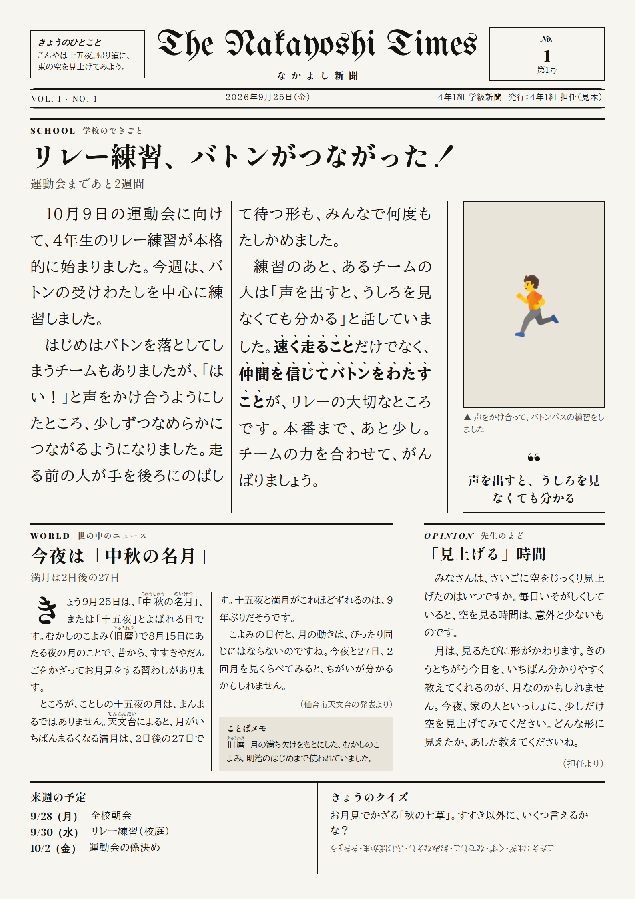

# 学級新聞メーカー

思いついたことを散文で送るだけで、AI（Claude）が文章に肉付けして、
児童向けの学級新聞（A4）の PDF にします。
紙面は英字新聞ふうの横書き（飾り文字の題字・段組み）。たて書きの和風版にも切りかえられます。



## つかいかた

このリポジトリを開いた Claude Code に、こんなふうに送るだけです。

```
新聞つくって。
学校：きょうから運動会のリレー練習。はじめバトンを落としてたけど、
声をかけあったらうまくいくようになった。「声を出すと見なくても分かる」と言ってた子がいた。
世の中：今夜は十五夜らしい
その他：空を見上げる時間って大事、みたいなコラム。来週の予定は 28日全校朝会、30日リレー練習。
```

AI がやること：

1. 3つ（学校／世の中／その他）に分ける
2. 子ども向けの文に肉付けする（学年に合わせた漢字・ふりがな、見出し、ことばメモ、クイズなど）
   - 学校のことは、書いていない出来事や数字を作りません
   - 世の中のニュースは、Web で事実を確かめて出典をつけます
3. 新聞の形に組んで、印刷用の PDF をわたす

「見出しをもっと元気に」「2年生向けにして」「B4で」「たて書きで」などと返せば、直して組み直します。

AI への細かい指示は [`.claude/skills/shinbun/SKILL.md`](../.claude/skills/shinbun/SKILL.md) にあります。
新聞の名前・学年・号数は [`settings.json`](settings.json) で変えられます。

## ファイル

| ファイル | 中身 |
|---|---|
| `template.html` | 紙面のデザイン（英字新聞ふう・横書き・段組み・ふりがな） |
| `template-tate.html` | たて書きの和風レイアウト（`--tate` で使う） |
| `build.mjs` | JSON から HTML と PDF を作るスクリプト |
| `settings.json` | 新聞の名前、学年、次の号数など |
| `issues/` | 各号の JSON（原稿）・HTML（画面用）・PDF（印刷用） |

手で組むとき：`node shinbun/build.mjs shinbun/issues/2026-09-25-mihon.json`（B4 は `--b4`、たて書きは `--tate`）。
PDF づくりには Playwright（Chromium）を使います。記事の文字の大きさは、枠に収まるいちばん大きいサイズに自動でそろいます。
